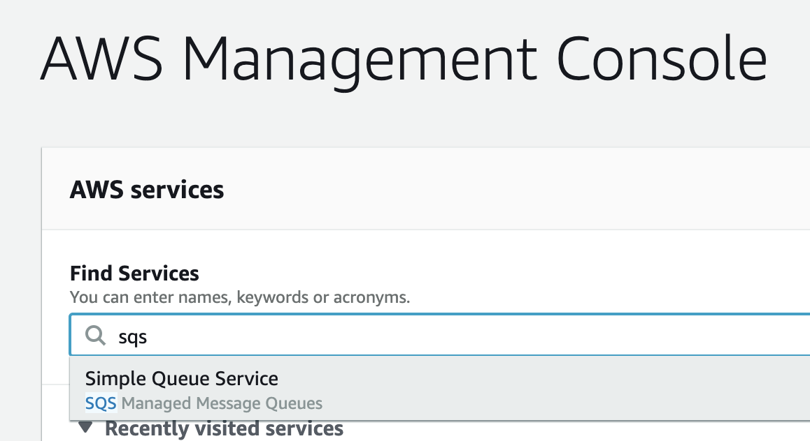
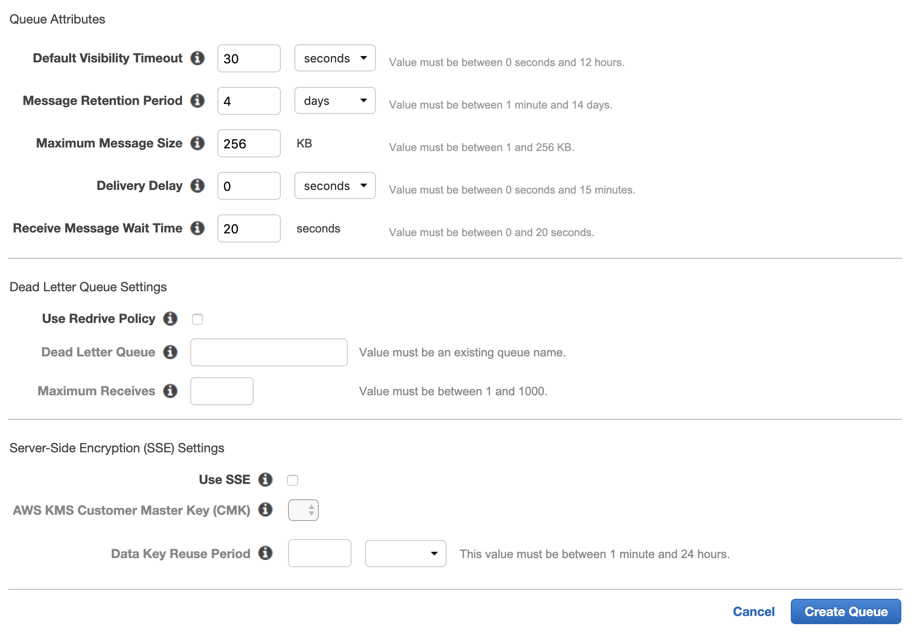

# Create an SQS (Simple Queuing Service) queue

#### Summary
Use this article to create
an SQS queue.

#### Steps 

1. Open the 
   [SQS page](https://aws.amazon.com/sqs/#) 
   and click **Get started for free**.

1. In the AWS management console, search
   for and then select **sqs**. See 
   figure 1.

   

   Figure 1. Search for, and then select **sqs**

1. In the SQS management console,
   click **Create New Queue**. See figure 2.

   

   Figure 2. Click **Create New Queue**

1. Enter a name for the queue.

   Either a `Standard` or `FIFO` queue can be used.

   Click **Configure Queue** (at the bottom
   of the page). The page will then 
   expand to show additional options.

1. Enter `20` for the 
   **Receive Message Wait Time**

   Click **Create Queue**. See figure 3.

   

   Figure 3. Click **Create Queue**

1. The queue will be created. The 
   queue management page will be show.

   Record the **URL** from the **Details**
   tab at the bottom of the page. This is 
   the **Queue URL**. See figure 4.

   Record the **Region name** shown 
   as the subdomain of `amazonaws.com` in the
   queue url.

   Example: if the queue url is 
   https://sqs.us-east-2.amazonaws.com/760496504314/dsconnect.fifo	

   then the **Region name** is `us-east-2`

   

   Figure 4. Record the **Queue URL**

Next: [Create the Lambda function](INSTALLATION_3_lambda_function.md)
