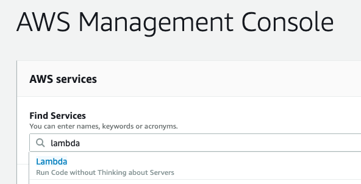
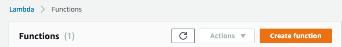
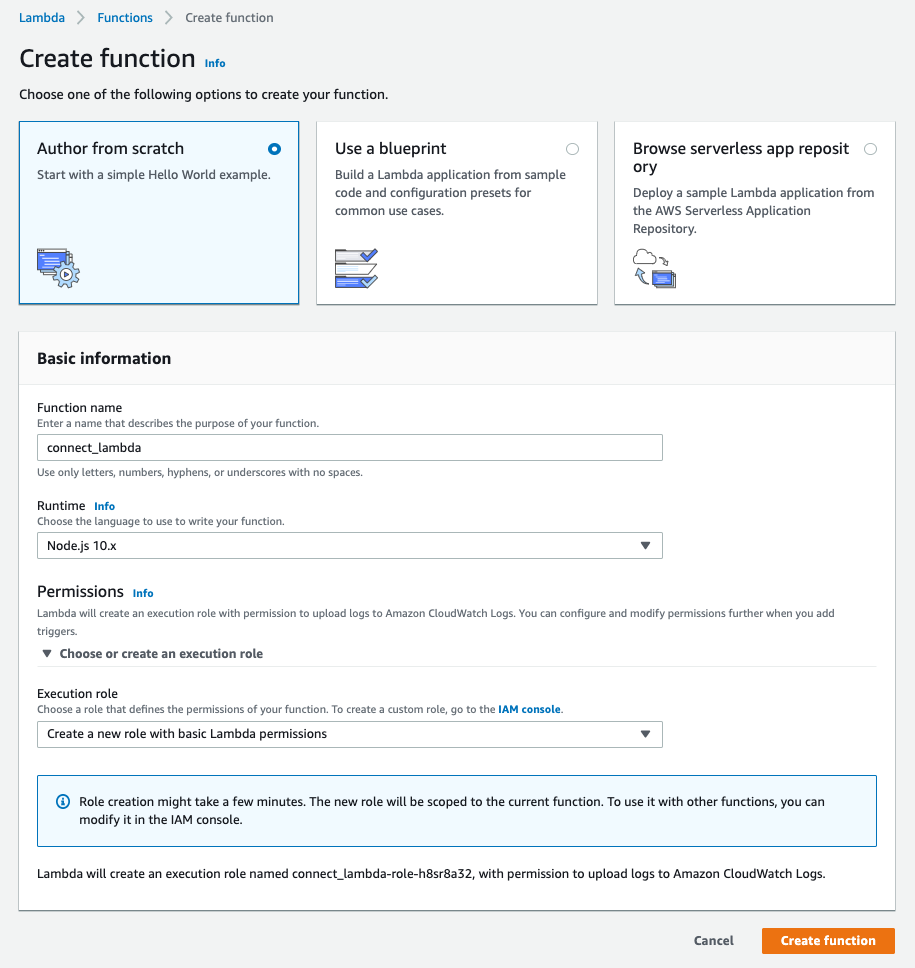
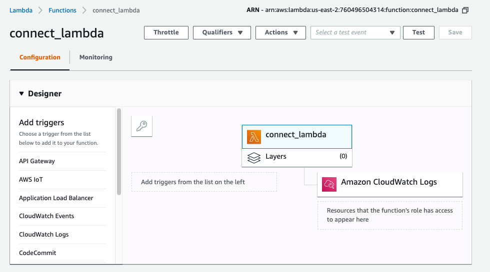
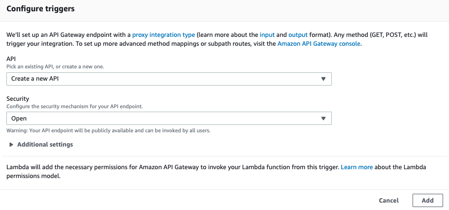
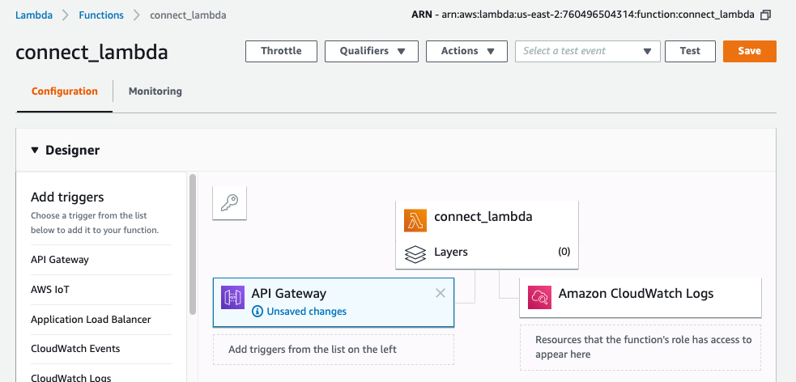
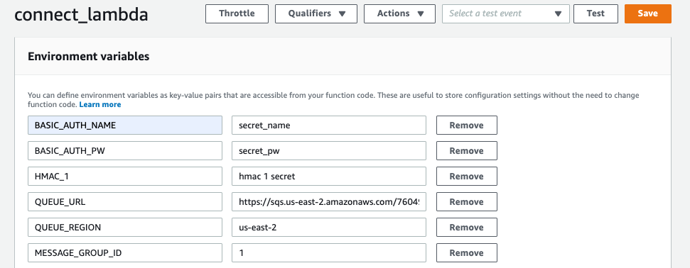

# Create the Lambda function

#### Summary
Use this article to create a 
**Lambda** serverless function.

1. In the AWS management console, search
   for and then select **lambda**. See 
   figure 1.

   

   Figure 1. Search for, and then select **lambda**

1. On the Lamdba Functions page, click **Create function**.
   See figure 2.

   

   Figure 2. Click **Create function**

1. Create a Lambda function as shown in figure 3.

   **Create option:** Author from scratch

   **Function name:** choose a name for your function

   **Runtime:** `Node.js 10.x` or `Node.js 8.x`

   **Permissions / Execution role:** 
   `Create a new role with basic Lambda permissions` 

   Click **Create function**

   It will take a couple of minutes to create the function
   and its IAM role.

   

   Figure 3. Complete the form and click **Create function**

1. After AWS creates your Lambda function, you will see
   the function's page. 

   Near the top of the page, open the **Designer** section of
   the page as shown in figure 4.

   

   Figure 4. The **Designer** section of the function's page.

1. On the left side of the page, in the **Add triggers**
   section, click **API Gateway**. 

   In the **Configure triggers** section, set the form:

   **API:** `Create a new API`

   **Security:** `Open`

   **Additional settings**: use the defaults

   Click **Add** as shown in figure 5.

   

   Figure 5. Add an API Gateway trigger.

1. Save the updated function design by clicking the **Save**
   button at the top right of the Lambda function's screen.
   See figure 6. 

   

   Figure 6. **Save** the changes to the function.

1. The function's API Gateway trigger has been added
   and saved.
   
   Select the **API Gateway** trigger in the designer.
   The designer will then show the 
   API Gatewy settings, including the **API Endpoint**.

   Record the **API endpoint**, you will use it when you 
   configure DocuSign Connect. See Figure 7.

   

   Figure 7. Select the **API Gateway** and 
   record the **API endpoint** URL.

1. Select the name of the Lambda function in the 
   designer. (In this example, the Lambda function is
   named `connect_lambda`.)

1. The function code will be shown in the bottom of the 
   screen. 

   Replace the existing **index.js** code with the 
   code from this repository's **index.js** file.

   In the Code editor, use **File > New File** to 
   add the code from this repository's **package.json**
   file.

   Then use **File > Save As...** to store the new
   file as **package.json**. See figure 8.

   

   Figure 8. Select the name of the function and 
   then use the code editor.

1. Save the updated function design by clicking the **Save**
   button at the top right of the Lambda function's screen.

1. Select the name of the Lambda function in the 
   designer. (In this example, the Lambda function is
   named `connect_lambda`.)

1. Set the **Environment variables** for the function.
   They're set using the form that is below the code 
   editing form. See figure 9. Set these variables:

   **BASIC_AUTH_NAME:** used to enforce basic authentication.
   Set the same value here and in the DocuSign Connect 
   subscription.

   **BASIC_AUTH_PW:** Same as your Connect setting

   **HMAC_1:** Same as the HMAC secret for HMAC signature 1 in
   Connect. Remember to also enable HMAC for the specific 
   Connect subscription. 
   
   **QUEUE_URL:** The SQS queue url

   **QUEUE_REGION:** The SQS queue region. Eg `us-east-2`
 
   **MESSAGE_GROUP_ID:** Used for FIFO queues. Use `1`

   Click **Save** at the top of the page to save your changes.

   

   Figure 9. Add the environment variables and click **Save**
   at the top of the page.

1. Add an additional IAM permission policy to the 
   function's role.

   Your Lambda function will need permission to
   enque messages on to the SQS queue.

   In the following steps we'll add the additional
   permission to the function's role.

1. In the designer, select the function.

   Below the Environment variables pane, in the
   **Execution role** pane, click the link for
   viewing the function's role in the IAM console.
   See figure 10.

   

   Figure 10. Click the link to update the function's
   IAM role.

1. Clicking the link will open an IAM console
   to the summary page for the Lambda function's
   role.

   Click the **Attach policies** button.

   The **Attach Permissions** chooser will be shown.

   Search
   the existing policies for `sqs` and then use the
   checkbox and the **Attach policy** button to add the 
   existing `AmazonSQSFullAccess` policy to the role.
   See figure 11.

   As an alternative, you can create a new policy 
   specific to your SQS queue.

   

   Figure 11. Click the checkbox for the
   `AmazonSQSFullAccess` policy and then click the 
   **Attach policy** button to add the policy to the 
   Lambda function's role.

   

